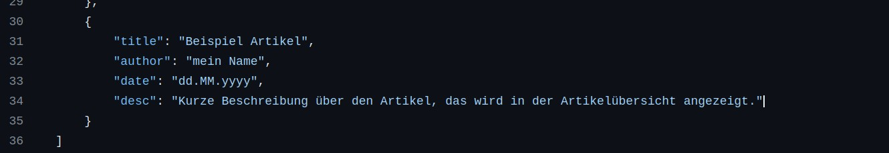

# Deinen ersten Artikel schreiben

## Idee bewerten

Irgendwie selbstverständlich, aber du solltest eine Idee haben worum der Artikel geht, wie er aufgebaut ist, etc.

Hier ein paar gute Fragen, die du dir selbst stellen kannst:

1. Passt der Artikel zu HzgShowAround/der Herzogsägmühle? Natürlich nicht Alles, was man schreiben kann, passt zu dem Thema/Ort Herzogsägmühle. Es ist wichtig, dass es zumindest einen Zusammenhang gibt! :)

2. Ist er interessant, berichtenswert oder unterhaltsam? Dein Artikel sollte zumindest under einem der Begriffen landen.

3. Ist es okay das im Internet zu veröffentlichen? Manchmal vergessen wir, dass so ziemlich jeder Alles im Internet einsehen kann. Sind Personen, die im Artikel genannt oder gezeigt werden, damit einverstanden?

## Artikel verfassen

Es gibt zwei verschiedene Wege einen Artikel zu schreiben. Entweder du schreibst dein eigenes HTML (im Unterordner `resources/articles/`), oder du verfasst ihn komplett in [JSON (JavaScript Object Notation)](https://de.wikipedia.org/wiki/JavaScript_Object_Notation). Um JSON kommst du leider nicht drum herum, denn du must deinen Artikel in der Datei `articles.json` einfügen.

Keine Sorge, es wird Alles noch erklärt! :)

Es ist ratsam die [Artikel Sektion](../README.md#artikel) durchzulesen.

### HTML

Wie man einen HTML Artikel schreibt wird [hier erklärt](../README.md#html).

### JSON

Wie man einen JSON Artikel schreibt wird [hier erklärt](../README.md#json).

### Beispiel

Einen Artikel in JSON zu verfassen ist für die Meisten einfacher, also wird dieses Beispiel so vorangehen.

#### Schritt-für-Schritt Einleitung

##### 1. Artikel Datei

Um Artikel hinzuzufügen, arbeiten wir mit der `articles.json` Datei.


Ungefähr so sieht sie aus. Nicht verschrecken, das was schon geschrieben ist, kann man ignorieren (oder sich daran orientieren).


Um die Datei zu beartbeiten, klicke auf das Stiftsymbol. Das funktioniert nur, wenn du eingeloggt bist und zu dem Projekt hinzugefügt bist.


##### 2. Artikel Meta-Data

In JSON gibt es diese Datenkonstrukte:

* Objekt: `{ ... }`

* Array/Liste: `[ ... ]`

Als Erstes erstellen wir ein leeres Objekt in JSON.


Danach fügen wir den Titel deines Artikel hinzu (der wird dannach ganz oben erscheinen).


Danach kannst du optional deinen Namen hinzufügen; es muss nicht dein Echter sein.

Wenn du keinen Namen angibst, wird der Autor als `Anonym` angezeigt.


Ein weiteres optionales Feld ist das Datum. Es ist ratsam eins beizufügen, da die Artikel auf der Artikel-Übersicht nach dem Datum geordnet werden (Neuste zuerst).

Das Datum sollte im Format `dd.MM.yyyy` (deutsch: `TT.MM.YYYY`) angegeben werden.

Wenn du kein Datum angibst, wird intern das Datum zu `01.01.0001` gesetzt (damit sie ganz hinten angezeigt werden).


Als Nächstes fügen wir eine kurze Beschreibung hinzu. Es ist ein optionales Feld, aber es ist ratsam eine interessante Beschreibung anzugeben, da der Leser dann schnell sich orientieren kann worum es im Artikel geht.



##### 3. Artikel Content

Jetzt kommt das Relevante - der Artikel selbst. Dazu erstellen wir eine Liste.


Jede Linie, die hinzugefügt wird, ist ein einzelner Paragraph. Du kannst `\n` verwenden, um eine neue Linie im selben Paragraph zu verwenden. Der Text der nächsten Zeile wurde hier markiert:


Um nicht nur eine Wand aus Text zu haben kannst du Überschriften und Bilder hinzufügen. Wir fangen mit den Überschriften an.

Wie du im Bild siehst, musst du ein Leerzeichen zwischen dem `#` und dem Überschrift-Text beifügen.


Nun kommen wir zum coolen Teil: BILDER!

Alle Bilder die verwendet werden können müssen hier hochgeladen werden und sich im Unterordner `resources/images/articles/` befinden.

Ein Bild im Pfad...

* ... `resources/images/articles/Artikel-Name/bild.png` wird dann mit `Artikel-Name/bild.png` aufgerufen.
* ... `resources/images/articles/bild.png` wird dementsprechend mit `bild.png` aufgerufen.


Es gibt auch Alternativen wie man ein Bild hinzufügt (du kannst das benutzen, was dir mehr gefällt, alle Arten zeigen das Bild auf selber Weise).


Nur eine Überschrift ist langweilig... es gibt 6 Verschiedene. Je mehr `#`s, desto kleiner ist die Überschrift.


---

Das beendet das kleine Tutorial. Du hast deinen ersten Artikel verfasst! YIPPIE!

#### Vollständiger Artikel

##### Artikel aus dem Tutorial

Das ist der Artikel aus dem Tutorial (minimal verändert, Datum weggelassen, Autor umbenannt):

```json
{
     "title": "Beispiel Artikel",
     "author": "Beispiel",
     "desc": "Kurze Beschreibung über den Artikel, das wird in der Artikelübersicht angezeigt.",
     "body": [
         "Das ist ein Absatz.\nDas wird auf einer neuen Linie.",
         "# Große Überschrift",
         "#KEINE Überschrift, weil zwischen dem # und dem Text ein Leerzeichen sein muss!",

         "Hier ein Bild (WICHTIG: es muss auf einer eigenen Linie sein und mit  anfangen und </img> enden):",
         "bild.png</img>",

         "So kann man auch Bilder anzeigen lassen:",
         "",
         "",

         "<bild>bild.png</bild>",

         "## Untergeordnete Überschrift (h2 in HTML)",
         "### h3",
         "#### h4",
         "##### h5",
         "###### h6"
    ]
}
```

##### Generiertes HTML

Der JSON-Artikel wird von einem Programm zu HTML konvertiert. So sieht das Resultat aus:

```html
<!DOCTYPE html>
<html>
<head>
    <meta charset="utf-8">
    <meta name="viewport" content="width=device-width, initial-scale=1">
    <title>Artikel - Beispiel Artikel - HzgShowAround</title>
    <meta name="description" content="Kurze Beschreibung über den Artikel, das wird in der Artikelübersicht angezeigt.">
    <link rel="stylesheet" href="article-styles.css">
</head>
<body>
    <div class="generic-center"><a href="../index.html" class="button">← Startseite</a>
    <a href="../articles.html" class="button">← Artikel</a></div>
    <hr>
    <h1>Beispiel Artikel</h1>
    <p class="generic-center"><small>Autor: Beispiel</small><br />Kurze Beschreibung über den Artikel, das wird in der Artikelübersicht angezeigt.</p>
    <hr>
    <p>Das ist ein Absatz.<br />Das wird auf einer neuen Linie.</p>
    <h1>Große Überschrift</h1>
    <p>#KEINE Überschrift, weil zwischen dem # und dem Text ein Leerzeichen sein muss!</p>
    <p>Hier ein Bild (WICHTIG: es muss auf einer eigenen Linie sein und mit  anfangen und </img> enden):</p>
    
    <p>So kann man auch Bilder anzeigen lassen:</p>
    
    
    
    <h2>Untergeordnete Überschrift (h2 in HTML)</h2>
    <h3>h3</h3>
    <h4>h4</h4>
    <h5>h5</h5>
    <h6>h6</h6>
    <hr>
    <p><br /></p>
    <footer class="generic-center-100-width">🄯 by nirokay | <small>Updated at 2023-12-20 - 11:19</small> | <a href="https://github.com/nirokay/HzgShowAround">Source</a> | <a href="../terms-of-service.html">Terms of Service</a></footer>
    <!-- Cloudflare Web Analytics --><script defer src='https://static.cloudflareinsights.com/beacon.min.js' data-cf-beacon='{"token": "301cf8a5a1c94af5987a04c936a8d670"}'></script><!-- End Cloudflare Web Analytics -->
</body>
</html>
```

Und so sieht es im Browser aus:


Wie zu sehen ist, wenn ein Bild nicht existiert, wird "Bild nicht vorhanden" angezeigt.

Du kannst [diesen Artikel](https://nirokay.github.io/HzgShowAround/article/beispiel_artikel.html) auch für dich selbst online einsehen!

## Weitere Beispiele

[Ein Artikel den ich in JSON verfasst habe](https://nirokay.github.io/HzgShowAround/article/findus_-_katzen_von_herzogsaegmuehle.html) sieht so aus:

```json
{
    "title": "Findus - Katzen von Herzogsägmühle",
    "author": "nirokay",
    "date": "13.12.2023",
    "desc": "Heute wird Findus, der Kater, vorgestellt! :)",
    "body": [
        "findus/bed_eepy.jpg</img>",
        "Ein junger, hungriger und sehr müder Bursche.\nMan kann ihn fast überall antreffen, ob am Am Latterbach, Mühlenmarkt oder sogar auf der Oblandstraße Richtung Obland (wow...)!",
        "Wenn es regnet oder kalt ist, verkriecht er sich gerne in einem Haus und macht es sich auf der Couch gemütlich.",
        "findus/door.jpg</img>",
        "findus/couch_eepy.jpg</img>",
        "Leider mögen das die Betreuer nicht so gerne, deshalb bitte den Frechdachs gut eindecken und verstecken."  ,
        "Mir fällt nicht mehr viel Text ein, also hier einfach ein paar Bilder von ihm:",
        "findus/couch_eepy_silly.jpg</img>",
        "findus/couch_eepy_relaxed.jpg</img>",
        "findus/bed_silly_stretch.jpg</img>",
        "findus/chilling_on_da_floor.jpg</img>",
        "findus/slurp.jpg</img>",
        "findus/nose_boop.jpg</img>"
    ]
}
```
